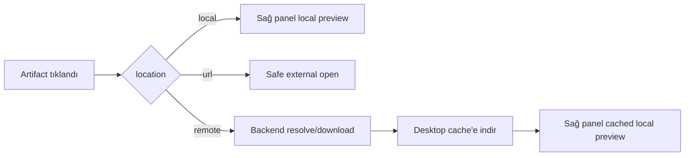

# PRD: Desktop Artifacts ve Preview Yüzeyi

## Genel Bakış

Hermes Desktop içinde halihazırda bir Artifacts sayfası ve sağ panel dosya preview sistemi var; ancak bu iki yüzey gevşek bağlı. Bu PRD, üretilen dosyaları, bağlantıları, görselleri, tool çıktılarını ve session bazlı preview hedeflerini birinci sınıf, aranabilir, preview edilebilir ve kaynak konuşmaya bağlanabilir bir kullanıcı deneyimine dönüştürecek bütünlüklü desktop artifacts ve preview mimarisini tanımlar.

İlk sürüm, mevcut desktop app mimarisi üzerine kurulmalı; yeni core agent tool eklememeli ve model tool schema değiştirmemelidir.

## Mevcut Durum Bulguları

- Desktop app içinde `/artifacts` route'u zaten var; `DesktopController` üzerinden mount ediliyor ve `ArtifactsView` ile uygulanıyor.
- `ArtifactsView`, artifact'leri şu anda client tarafında yeniden oluşturuyor: son session'ları listeliyor, mesajlarını okuyor, sonra mesaj metni ve structured parts içinden olası dosya/link/görsel değerlerini çıkarıyor.
- Artifact kayıtları view-local; normalize edilmiş kalıcı backend/index sözleşmesi yok.
- Mevcut artifact kategorileri fiilen `image`, `file` ve `link`.
- Artifact açma genellikle `window.hermesDesktop.openExternal` veya browser fallback yoluna gidiyor.
- Sağ panelde `store/preview.ts` ve `LocalFilePreview` üzerinden file preview tab desteği zaten var.
- File preview şu yetenekleri zaten destekliyor: image render, markdown rendered/source modları, source highlighting, git diff modu, large/binary güvenlik uyarıları, file watching, sınırlı text edit.
- Tool row'ları `recordPreviewArtifact` çağırarak session bazlı preview status kayıtları oluşturabiliyor.
- Artifacts sayfası ve preview rail şu anda tek artifact modeli, tek preview açma yolu veya kalıcı artifact index paylaşmıyor.
- Kanban/task completion tarafında backend artifact kavramı var: completed payload artifact path taşıyabiliyor ve gateway delivery bunları kullanabiliyor; ancak desktop artifacts bu unified backend artifact akışını tüketmiyor.

## Problem

Kullanıcılar Hermes'e dosya, görsel, rapor, diyagram, doküman, kod patch'i ve link ürettirebiliyor; fakat desktop app içinde birleşik bir artifact yaşam döngüsü yok. Özellikle remote backend + local Windows desktop kurulumunda artifact hedefi backend makinesindeki path veya backend-origin URL olabiliyor; local desktop bunu external URL ya da local file gibi açmaya çalışınca preview başarısız oluyor (`open failed invalid external url` gibi hatalar).

- Üretilen çıktıları session'lar arasında tekrar bulmak zor.
- Preview edilebilir local dosyalar Artifacts sayfasından tutarlı şekilde desktop preview rail içinde açılmıyor.
- Artifacts sayfası heuristik mesaj taramasına bağlı; bu yaklaşım yavaş, eksik ve zor doğrulanır.
- Tool-generated preview hedefleri ile artifact arama sonuçları ayrı modellerde tutuluyor.
- Remote backend üzerinde oluşan artifact path'leri local Windows client tarafından doğrudan okunamıyor.
- Artifact target'ın local file mı, remote backend resource mı, yoksa public URL mi olduğu açık modellenmiyor.
- HTML, PDF, görsel metadata, doküman, dataset veya çok dosyalı bundle gibi daha zengin preview türleri için net mimari yok.

## Hedefler

- Desktop içinde session'lar arası dosya, görsel, link ve üretilmiş çıktılar için birinci sınıf Artifacts yüzeyi sağlamak.
- Local file artifact'leri için her şeyi dışarı açmak yerine mevcut sağ panel preview sistemini yeniden kullanmak.
- Artifact listing, chat tool row ve preview tab'leri için ortak normalize artifact veri modeli tanımlamak.
- Hermes'in narrow-core mimarisini korumak: mutlak gerekmedikçe yeni core model tool eklememek.
- Mevcut session history ile artifact discovery çalışmaya devam ederken gelecekte durable backend index'e geçişi mümkün kılmak.
- Uygulamayı artımlı yapmak: önce UI entegrasyonu, sonra persistence/indexing.

## Hedef Dışı

- v1 içinde yeni core model tool eklenmeyecek.
- Desktop chat transcript yeniden yazılmayacak, assistant-ui değiştirilip yerine yeni transcript kurulmayacak.
- Tam cloud artifact store uygulanmayacak.
- Local artifact'ler varsayılan olarak dış servise upload edilmeyecek.
- Güvenilmeyen HTML/JS unsafe webview içinde çalıştırılmayacak.
- İlk desktop slice içinde gateway artifact delivery semantiği değiştirilmeyecek.
- Daha sonraki backend slice kabul edilmedikçe ilk UI-only entegrasyon için schema migration gerekmeyecek.

## Hedef Kullanıcılar

- Hermes Desktop ile dosya, görsel, doküman, diyagram, rapor, link ve kod artifact'i üreten veya alan kullanıcılar.
- Hermes Desktop'ı coding/research workspace olarak kullanan geliştiriciler.
- Önceki session çıktıları içinde tekrar gezmek isteyen power user'lar.

## Yeniden Kullanılacak Mevcut Bileşenler

- Mevcut Artifacts sayfası için `apps/desktop/src/app/artifacts/index.tsx`.
- Preview tab ve sağ panel preview state için `apps/desktop/src/store/preview.ts`.
- Local file preview rendering/editing için `apps/desktop/src/app/chat/right-rail/preview-file.tsx`.
- Session-scoped preview artifact ipuçları için `apps/desktop/src/store/preview-status.ts`.
- Tool-row preview registration için `apps/desktop/src/components/assistant-ui/tool/fallback.tsx`.
- Güvenli file URL normalization, watching ve external opening için `apps/desktop/electron/main.cjs` ve preload API'leri.
- Backend artifact index gerekli olursa yalnızca `tui_gateway` ve shared JSON-RPC client.

## Önerilen Mimari

### Katman 1: Artifact Domain Model

Mevcut heuristik artifact'leri ve gelecekte backend-indexed artifact'leri temsil edebilecek desktop-local bir artifact modeli eklenecek.

```ts
interface DesktopArtifact {
  id: string
  kind: 'file' | 'image' | 'link' | 'text' | 'bundle'
  label: string
  target: string
  href?: string
  mimeType?: string
  byteSize?: number
  sessionId?: string
  sessionTitle?: string
  profile?: string
  messageId?: string
  toolCallId?: string
  cwd?: string
  timestamp: number
  source: 'message-scan' | 'tool-preview' | 'kanban' | 'backend-index'
  location: 'local' | 'remote' | 'url'
  backendId?: string
  downloadUrl?: string
  previewUrl?: string
  localCachePath?: string
  preview?: ArtifactPreviewCapability
}
```

Preview capability açıkça ifade edilmeli:

```ts
interface ArtifactPreviewCapability {
  mode: 'right-rail' | 'remote-fetch' | 'external' | 'inline-image' | 'unsupported'
  reason?: string
}
```

### Katman 2: Artifact Collection Service

Artifact discovery, `ArtifactsView` içinden çıkarılıp pure desktop library içine taşınacak.

Önerilen modül:

- `apps/desktop/src/lib/artifacts.ts`

Sorumluluklar:

- Session mesajlarından artifact normalize etmek.
- Preview-status entry'lerinden artifact normalize etmek.
- Stable key ile dedupe yapmak: kind + normalized target + session/profile/message/tool metadata.
- Preview capability hesaplamak.
- Component-local tekrar olmadan sort/filter/search sağlamak.

Böylece `ArtifactsView` yalnızca render/fetch/state orchestration yapar.

### Katman 3: Preview Bridge

Artifact açmak için tek shared action eklenecek:

- local previewable file/image -> `setSessionPreviewTarget` / `openFilePreviewTarget`
- link -> external browser
- unsupported/binary/large -> sağ panel uyarısı veya external open

Önerilen modül:

- `apps/desktop/src/lib/open-artifact.ts`

Davranış:

- Local path'ler mevcut `normalizeOrLocalPreviewTarget` üzerinden resolve edilir.
- Desteklenen local file/image artifact'leri sağ panelde açılır.
- Link ve preview edilemeyen dosyalar Electron `openExternal` ile açılır.
- Hatalar mevcut notification utility'leriyle gösterilir.

### Katman 3.5: Remote Artifact Bridge

Remote backend + local desktop kurulumunda artifact hedefleri local filesystem olarak açılamaz. Bu yüzden remote artifact'ler path string'i olarak değil, backend tarafından resolve/download edilebilen resource olarak ele alınmalıdır.

Önerilen davranış:



Gerekli backend/Desktop sözleşmesi:

- `artifacts.resolve`: Artifact id/path bilgisini güvenli preview/download metadata'ya çevirir.
- `artifacts.download`: Remote artifact bytes'larını desktop client'a stream eder.
- Alternatif HTTP endpoint: `/api/artifacts/{id}/download`.
- Desktop indirilen dosyayı kendi temp/cache alanına yazar ve mevcut `LocalFilePreview` akışını bu local cache path ile açar.

Güvenlik kuralları:

- Backend arbitrary absolute path download ettirmemeli.
- Artifact resolve sadece allowlisted artifact roots içinde çalışmalı.
- Path traversal, symlink escape ve unsupported scheme engellenmeli.
- Artifact ID, raw remote path'e tercih edilmeli.
- Remote artifact erişimi mevcut desktop/backend auth context'iyle yetkilendirilmeli.

UX kuralları:

- Remote artifact tıklanınca sağ panelde `Remote artifact getiriliyor...` loading state'i gösterilir.
- Başarıda cached local preview açılır.
- Hata durumunda `Remote artifact unavailable`, `permission denied`, `expired` gibi net state gösterilir.
- Retry, Download, Open Chat aksiyonları sağlanır.

### Katman 4: Artifacts Page UI

Yeni yüzey yaratmak yerine mevcut Artifacts sayfası güncellenecek.

Gerekli UI yetenekleri:

- Tab'ler: All, Files, Images, Links; ileride opsiyonel Text/Bundles.
- Search: label, target/path, session title, source tool.
- Görseller için card görünümü.
- Dosya/link için table görünümü.
- Aksiyonlar: Preview, Open External, Reveal/Open Chat, Copy Path/URL.
- Source badge: Message, Tool, Kanban, Indexed.
- Preview aksiyonu sayfadan çıkmadan mevcut sağ paneli açmalı.

### Katman 5: Sağ Panel Preview Yüzeyi

Desktop local file'lar için canonical preview yüzeyi sağ panel olarak kalacak.

İyileştirmeler:

- Artifact sayfasından açılan preview'lerde artifact metadata header gösterilebilir.
- Mevcut modlar korunur: rendered markdown, source, diff, image.
- Large/binary uyarıları korunur.
- Edit capability yalnızca tam okunabilir text dosyaları için kalır.
- v1 içinde aktif HTML executable web content olarak preview edilmez.

### Katman 6: Gelecekte Backend Artifact Index

UI entegrasyonundan sonra, session taraması yavaş veya eksik kalırsa backend artifact index eklenir.

Aday backend seçenekleri:

- Session/message/tool metadata ile keyed SessionDB artifact table.
- `tui_gateway` veya desktop backend üzerinden JSON-RPC method'ları:
  - `artifacts.list`
  - `artifacts.record`
  - `artifacts.opened`

Bu persistence/API contract dokunduğu için ayrı implementation slice olmalı.

## User Story'ler

### US-001: Son Artifact'leri Görüntüleme
**Açıklama:** Desktop kullanıcısı olarak son session'lardan dosya, görsel ve link artifact'lerini tek Artifacts sayfasında görmek istiyorum; böylece çıktıları tekrar bulabilirim.

**Kabul Kriterleri:**
- [ ] Artifacts sayfası son session'lardan artifact listeler.
- [ ] Artifact'ler All, Files, Images, Links olarak filtrelenebilir.
- [ ] Search; label, path/URL ve session title üzerinden filtreler.
- [ ] Duplicate artifact'ler stabil davranışla collapse edilir.
- [ ] Desktop typecheck geçer.

### US-002: Local File Artifact Preview
**Açıklama:** Desktop kullanıcısı olarak local file artifact'lerini mevcut sağ panel preview içinde açmak istiyorum; böylece app'ten ayrılmadan çıktı inceleyebilirim.

**Kabul Kriterleri:**
- [ ] Local file üzerinde Preview tıklanınca sağ panel açılır.
- [ ] Markdown dosyaları uygun olduğunda rendered/source modlarıyla açılır.
- [ ] Görseller sağ panel içinde render edilir.
- [ ] Large veya binary dosyalar mevcut güvenli uyarı yolunu gösterir.
- [ ] External open aksiyonu mevcut kalır.

### US-003: Artifact Kaynak Bağlamını Korumak
**Açıklama:** Kullanıcı olarak her artifact'in hangi session tarafından üretildiğini görmek istiyorum; böylece kaynak konuşmaya geri dönebilirim.

**Kabul Kriterleri:**
- [ ] Her artifact session title veya fallback session id gösterir.
- [ ] Artifact aksiyonu ilgili chat session'ı açar.
- [ ] Profile/session metadata mümkün olduğunda korunur.
- [ ] Eksik/silinmiş session'lar graceful fail eder.

### US-004: Tool Preview Artifact'lerini Yüzeye Taşımak
**Açıklama:** Kullanıcı olarak tool row'ları tarafından kaydedilen artifact'lerin Artifacts sayfasında görünmesini istiyorum; böylece tool çıktıları tek session içinde kaybolmaz.

**Kabul Kriterleri:**
- [ ] `preview-status` entry'leri `DesktopArtifact` kayıtlarına normalize edilir.
- [ ] Tool-preview artifact'leri message-scanned artifact'lerle dedupe edilir.
- [ ] Relative target resolve için CWD kullanılır.
- [ ] Broken path crash yerine unavailable state gösterir.

### US-005: Link'leri Güvenli ve External Açmak
**Açıklama:** Kullanıcı olarak URL artifact'lerinin external açılmasını istiyorum; böylece desktop app unsafe remote content'i inline render etmez.

**Kabul Kriterleri:**
- [ ] HTTP/HTTPS artifact'leri mevcut external-open path ile açılır.
- [ ] File URL'leri mevcut Electron-safe handler'lar üzerinden normalize edilir.
- [ ] Desteklenmeyen scheme'ler block edilir veya unsupported gösterilir.
- [ ] Hatalar mevcut notification pattern'leriyle gösterilir.

## Fonksiyonel Gereksinimler

- FR-1: Desktop app, Artifacts sayfası ve preview-opening aksiyonları için tek normalize artifact modeli kullanmalıdır.
- FR-2: Artifacts sayfası backend migration gerektirmeden mevcut session-message verisiyle çalışmaya devam etmelidir.
- FR-3: Artifact collector input olarak session messages ve preview-status entry'lerini kabul etmelidir.
- FR-4: Artifact collector artifact'leri deterministik şekilde dedupe etmelidir.
- FR-5: Artifact opener previewable local file/image artifact'lerini mevcut sağ panel preview sistemine yönlendirmelidir.
- FR-6: Artifact opener linkleri ve unsupported file'ları güvenli external-open davranışına yönlendirmelidir.
- FR-7: Sağ panel preview large, binary, unreadable ve unsupported file güvenliklerini korumalıdır.
- FR-8: Artifact'ler session/profile/source metadata bilgisini mümkün olduğunda korumalıdır.
- FR-9: UI hataları non-destructive olmalı; failed artifact discovery veya preview chat ya da sağ paneli bozmamalıdır.
- FR-10: İlk implementation yeni core model tool veya core system prompt/tool schema değişikliği getirmemelidir.
- FR-11: Artifact modeli target'ın `local`, `remote` veya `url` olduğunu açıkça belirtmelidir.
- FR-12: Remote artifact'ler local Windows client tarafından doğrudan açılmamalı; backend resolve/download bridge üzerinden desktop cache'e alınmalıdır.
- FR-13: Remote artifact download sadece backend tarafında allowlisted artifact roots için çalışmalıdır.
- FR-14: Remote artifact preview loading/error/retry state'leri sağ panel içinde gösterilmelidir.

## Implementation Kararları

- v1 implementation desktop app içinde kalacak; ancak remote backend artifact preview için minimum JSON-RPC/HTTP bridge gerekebilir.
- Artifact normalization, desktop `src/lib` altında pure library olarak çıkarılacak.
- `ArtifactsView` route component olarak kalacak; fetch/state/render orchestration'a indirgenecek.
- `store/preview.ts`, tek sağ panel preview state owner olarak kullanılacak.
- Path normalization, file read, file watch ve external open için mevcut Electron preload/main IPC yeniden kullanılacak.
- Backend artifact indexing yalnızca UI davranışı stabil olduktan sonra ayrı PR olarak eklenecek; fakat remote artifact resolve/download bridge, local desktop + remote backend senaryosu için v1 kapsamında değerlendirilmelidir.
- HTML artifact'leri v1 içinde executable web preview değil, source/text preview kabul edilecek.
- PDF/dokümanlar v1 içinde mevcut preview desteği eklenene kadar external-open sayılacak.
- İleride setting eklenirse user-facing non-secret ayarlar `.env` değil config içinde tutulacak.

## Test Kararları

- Desktop test setup uygunsa artifact normalization/deduplication için unit test eklenecek.
- Open-action routing testleri eklenecek: local file -> preview rail, remote artifact -> backend download/cache/preview, link -> external open, unsupported -> error/unsupported state.
- Existing desktop component testleri route view'ları kapsıyorsa Artifacts page filters/search için component test eklenecek.
- Command palette dosyaları değişirse skill/quick-command desktop slash davranışının bozulmadığını doğrulayan regression test eklenecek.
- Snapshot-only testlerden kaçınılacak; davranış ve veri ilişkileri assert edilecek.
- Manual verification kapsamı: generated image, markdown file, large file warning, broken file path, HTTP link, session navigation.

## Başarı Ölçütleri

- Kullanıcı, Artifacts sayfasından üretilmiş local dosyayı en fazla iki tıklamayla bulup preview edebilir.
- File-browser ve composer attachment flow'ları için mevcut sağ panel preview davranışı değişmeden kalır.
- Artifacts page, recent-session window için responsive kalır.
- Yeni core tool schema footprint eklenmez.
- Duplicate artifact row sayısı raw message scanning'e göre azalır.

## Açık Sorular

- İlk Artifacts sayfası varsayılan olarak tüm profilleri mi, yalnızca active profile'ı mı taramalı?
- Artifact'ler indexlendikten sonra sonsuza kadar mı saklanmalı, yoksa backend indexing gelene kadar session history'den derived mı kalmalı?
- Gelecekte backend index artifact'leri tool-call anında mı, message-persist anında mı, yoksa ikisinde birden mi kaydetmeli?
- PDF/document inline preview ileride sandboxed viewer ile eklenmeli mi?
- Directory/multi-file output için artifact bundle v1.1 kapsamına alınmalı mı?

## Varsayımlar

- v1 core agent/tool schema değiştirmemeli; remote backend artifact bridge desktop/backend transport katmanında çözülmeli.
- İlk integrated UI slice için mevcut session-message scanning kabul edilebilir.
- Sağ panel, local file preview için canonical yüzeydir.
- External link ve unsupported document'lar güvenlik için app dışında açılmalıdır.
- Persistence/indexing daha sonra ayrı PR olarak, açık API/test kapsamıyla eklenebilir.

## Önerilen Implementation Slice'ları

### Slice 1: Normalize Model

- `apps/desktop/src/lib/artifacts.ts` içine `DesktopArtifact` ve helper'lar ekle.
- Mevcut `collectArtifacts*` logic'ini `ArtifactsView` dışına taşı.
- Kind detection, label/href normalization ve dedupe için unit test ekle.

### Slice 2: Shared Open Action

- `openDesktopArtifact` helper'ı ekle.
- Artifacts page Preview/Open aksiyonlarını bu helper üzerinden bağla.
- Local file'ların sağ panelde, linklerin external açıldığını doğrula.

### Slice 3: Tool Preview Entegrasyonu

- `preview-status` entry'lerini artifact collection içine merge et.
- CWD/session metadata bilgisini koru.
- Message-scanned artifact'lerle dedupe et.

### Slice 4: UI Polish

- Source badge ve net Preview/Open/Chat/Copy aksiyonları ekle.
- Artifact type bazlı empty/error state ekle.
- Image grid ve file table yapısını koru; aksiyonları tutarlı route et.

### Slice 5: Remote Artifact Bridge

- `DesktopArtifact.location` alanını `local | remote | url` olarak uygula.
- Remote artifact için `backendId`, `downloadUrl` veya resolve metadata üret.
- Backend tarafında allowlisted artifact roots ile resolve/download endpoint'i ekle.
- Desktop tarafında remote artifact'i local cache'e indir.
- Cached local path'i mevcut sağ panel preview sistemine yönlendir.
- Loading/error/retry state'leri ekle.
- Windows local desktop + remote backend senaryosu için regression test ekle.

### Slice 6: Backend Index RFC/PR

- Yalnızca v1 doğrulandıktan sonra SessionDB/JSON-RPC artifact index tasarla.
- Migration/API testlerini ayrı ekle.
